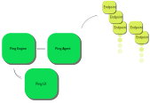

# 1. Pings In Space

This document describes the key principles and concepts of the Pings in Space project.

TLDR;

Pings In Space monitors things to see if they are on-line / out of threshold where these things are for example

- a website
- an HTTP/S endpoint
- a disk
- system load
- ..... ETC

In the event of a failure it will tell you about it in the form of

- text (SMS) messages
- integrations with 3rd parties such as OpsGenie / PagerDuty
- email
- ..... ETC

## Main Components

the following components comprise a minimal configuration :

- Ping Engine
- Ping Agent
- Ping Endpoint(s)

## Ping Engine

The Ping Engine is the main component which monitors for and generates alerts in response to events. Example events are where a system or systems are seen to be down or off-line or where a performance threshold is breached.
o
The Ping Engine is accessed via a REST API.

It issues alerts where configured to so so and these alerts may be SMS (mobile text alerts), emails or integrations to 3rd parties.

## Ping Agent

The second component, the agent, monitors endpoints and may perform a number of tests for availability and performance of one or more endpoints.

As each set of test results are obtained by the agent it sends these back to the Ping Engine for processing. It may store and forward these events as connectivity to the Ping Engine is available. If an agent is isolated from its parent Engine, for example by a network outage, it may collate results and send them when connections have been restored.

The agent may use any number of checks available for example from toolsets such as Nagios / Icinga or from any Nagios like 'plugin' that is created in the same manner as these plugins. Subsequently any test / health check may be added, making the agent(s) fully configurable to suit any monitoring requirements.

## Endpoint

An endpoint is anything that can be monitored by an agent which is either
local to or remotely acessible from an agent. Examples of an endpoint could be:

- HTTP / HTTPS web endpoint
- TCP / UDP Socket
- disk / cpu / memory

## UI

As the Ping Engine is accessible via a Restful API, the User Interfaces is entirely optional if that is all that is required, for example where another application is integrated with PingsInSpace using this API or where tools such as Postman are used to get / set status and configuration of alerts and thresholds.

However the UI makes setup simpler and more straight forward. Also, no knowledge of the API is required and therefore setup and configuration is made simpler.

## Pings In Space Diagram

Here all 4 components (above) are shown working together in as simple way as possible.

A Ping Agent 'polls' endpoints to obtain status and performance information of several endpoints. The status of each test is subsequently fed back to the Ping Engine where these are stored, summarised and monitored for breaches of performance thresholds.

The Ping User Interface makes this information available for viewing and the configuring of existing or additional endpoint tests.

The Ping Engine additionally processes and sends alerts that may be configured to be for example

- SMS
- Email
- Push messages to 3rd party providers such as to OpsGenie, PagerDuty, Nagios, Icinga

## Scaling, High Availability and Design Principles

Pings in Space is designed along [KISS](https://en.wikipedia.org/wiki/KISS_principle) principles where each component is intended to carry out as few as possible roles.
This enables each component to be more easily scoped and tested and for each component to be scaled in order to serve more demanding scenarios.

Any level of high availabilit may be reached but this depends upon the amount of effort and expenditure committed to based upon a cost benefit analysis.

### Coping with Agent Failures

As one or more agents may run at a time, additional agents can be deployed as the amount of endpoints to be tested increases.

If an agent stops working, it
can be marked as 'dead' by the engine which may in turn reject further input from the failing agent and subsequently
deploy additional agents to compensate for this loss. Newly instantiated agents may be then configured with the work load of the failing agent(s).

### Coping with Engine Failures

The Ping Engine is an API served by a web service endpoint which may
be run upon one or more instances and load balanced via high availability load balance solutions such as an API Gateway as provided
by Cloud Providors such as AWS or Azure or by self hosted instances of
HA Proxy or Nginx.

A database serves the back-end and this may be run as a cluster or stand alone component depending upon the level of resilience required. As Postgres SQL server is used this may be itself made resilient for on-prem based solutions by using Postgres's own cluster capability or by using [Cockroach DB](https://www.cockroachlabs.com/). For Cloud based implementations resilient SaaS Postgres may also be
used by any of the key players such as Azure or AWS.

The reporting and alerting function of the Engine role may be monitored and made resilient by another instance of Pings in Space or by a third party managed cron service such as [Cloud Scheduler](https://cloud.google.com/scheduler/)

### User Interface Availability

As the User interface is optional to the running of both Engines and Agents this may be considered to be 'ephemeral', as a failure to access the UI may be
tolerated as long as the service may be restored in a timely manner.

This said, as the UI is deployed as a Single Page Application, so long
as the Engine API is available, it may be served from a highly available endpoint such as a Web Application in Azure or equivalent AWS service. In on-prem implementations this may be made highly available by the same means as the Engine Restful API, utilising highly available load balancers.
